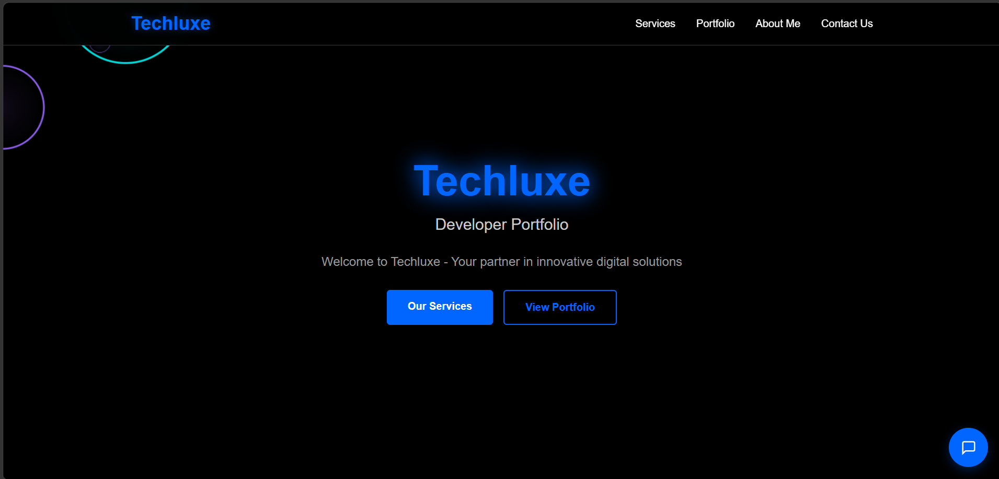
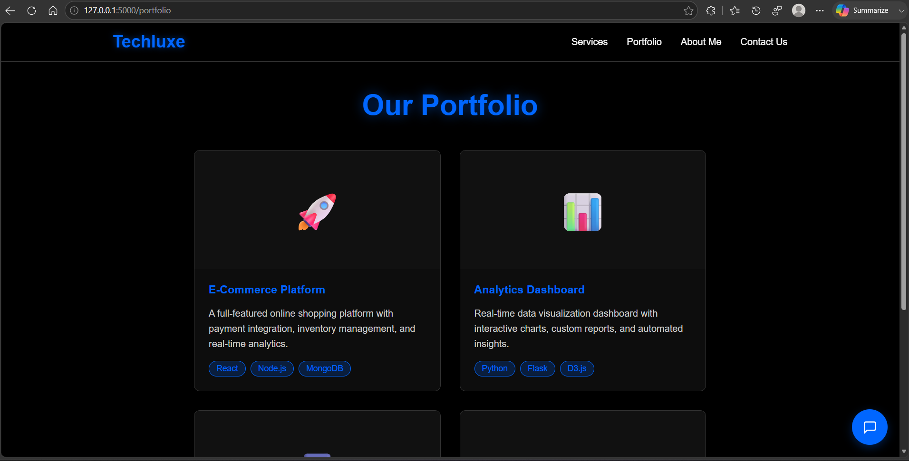
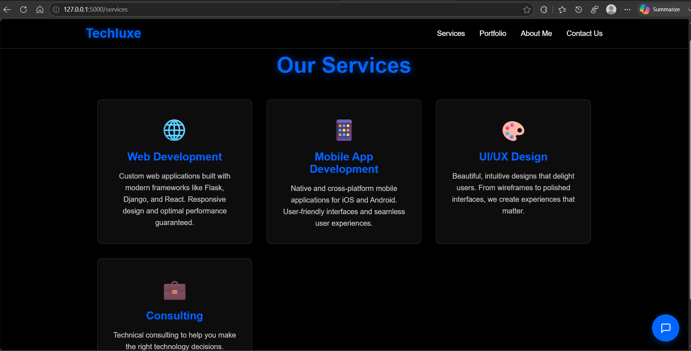
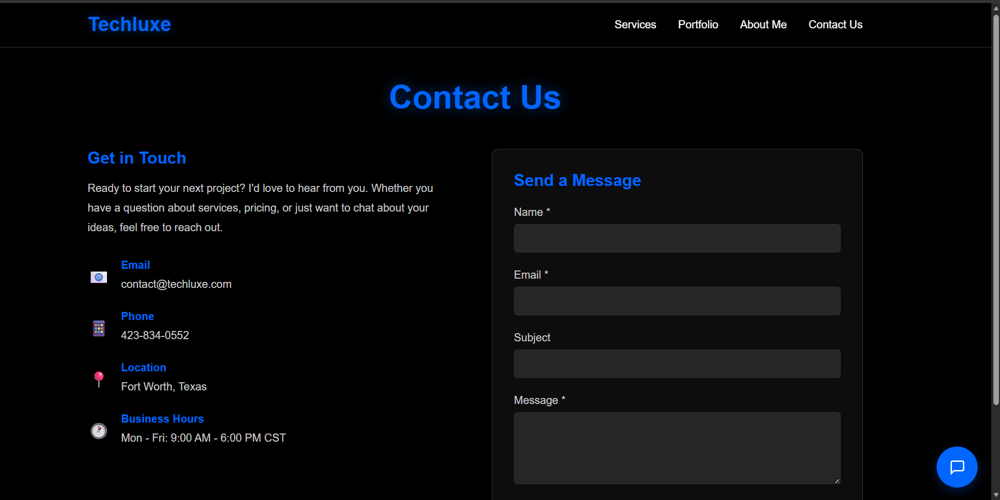
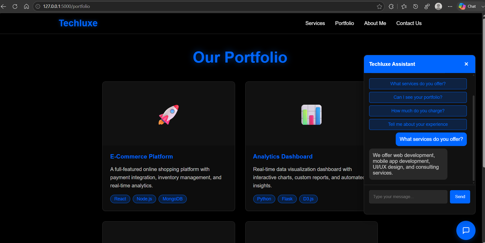

# Techluxe Portfolio Website

A modern developer portfolio website built with **Python Flask**, featuring a responsive multi-page interface, interactive chatbot, and custom UI animations.

---

## Features

- Responsive multi-page website
- Flask backend with dynamic routing
- Modern dark-themed interface
- Interactive chatbot for visitor questions
- Portfolio showcase
- Services page
- Contact form
- JavaScript-powered interactive effects
- Modular HTML templates
- Custom CSS styling

---

## Technologies

- Python
- Flask
- HTML5
- CSS3
- JavaScript
- Jinja Templates

---

## Pages

- Home
- Services
- Portfolio
- About
- Contact

---

## Screenshots

### Home Page



### Portfolio



### Services



### Contact



### Chatbot



---

## Installation

Clone the repository:

```bash
git clone https://github.com/cfabish/techluxe-portfolio.git
```

Navigate into the project:

```bash
cd techluxe-portfolio
```

Install dependencies:

```bash
pip install flask
```

Run the application:

```bash
python app.py
```

Open:

```
http://127.0.0.1:5000
```

---

## Project Structure

```
Techluxe/
│
├── app.py
├── templates/
│   ├── base.html
│   ├── index.html
│   ├── services.html
│   ├── portfolio.html
│   ├── about.html
│   └── contact.html
│
├── static/
│   ├── style.css
│   ├── chatbot.js
│   └── shockwave.js
│
└── README.md
```

---

## Skills Demonstrated

- Flask web development
- Python backend programming
- Frontend UI design
- HTML templating
- CSS animations
- JavaScript DOM manipulation
- REST-style endpoints
- Responsive web development

---

## Future Enhancements

- Replace placeholder portfolio cards with completed projects
- Add backend processing for the contact form
- Integrate an AI-powered chatbot
- Deploy the website to a cloud hosting platform

---

Created as a portfolio project to demonstrate full-stack web development with Python and Flask.
